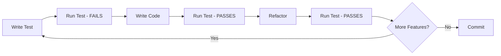

# Testing Strategy for Airflow + AWS Integration

## Executive Summary

This document outlines the comprehensive testing strategy for the Apache Airflow 2.10.5 + AWS integration project. The strategy emphasizes Test-Driven Development (TDD), comprehensive coverage, and fast feedback loops.

## Table of Contents

1. [Testing Philosophy](#testing-philosophy)
2. [Test Pyramid](#test-pyramid)
3. [Test Infrastructure](#test-infrastructure)
4. [Coverage Requirements](#coverage-requirements)
5. [Testing Workflow](#testing-workflow)
6. [CI/CD Integration](#cicd-integration)
7. [Performance Testing](#performance-testing)
8. [Maintenance](#maintenance)

---

## Testing Philosophy

### Core Principles

1. **Test-Driven Development (TDD)**
   - Write tests before implementation
   - Tests define the contract/API
   - Red-Green-Refactor cycle

2. **Fast Feedback**
   - Unit tests run in < 1 second each
   - Full unit test suite in < 30 seconds
   - Integration tests in < 2 minutes
   - Pre-commit hooks catch issues early

3. **Comprehensive Coverage**
   - Target 85%+ overall coverage
   - 100% coverage for critical paths
   - Edge cases and error conditions tested

4. **Realistic Testing**
   - Use moto for realistic AWS mocking
   - Test with real Airflow constructs
   - Validate actual DAG structures

5. **Maintainable Tests**
   - Clear test names
   - Shared fixtures for common setup
   - DRY principle with test utilities
   - Good documentation

---

## Test Pyramid

We follow the test pyramid model with emphasis on unit tests:

```
        /\
       /  \     E2E Tests (10%)
      /----\    ~50 tests, 10-60s each
     /      \   Full DAG execution
    /--------\
   /          \ Integration Tests (30%)
  /------------\ ~150 tests, 1-10s each
 /   Unit Tests \ Service integration
/________________\
    Unit Tests (60%)
    ~300 tests, <1s each
    Isolated components
```

### Distribution

| Test Level | Percentage | Count | Avg Time | Focus |
|------------|-----------|-------|----------|-------|
| Unit | 60% | ~300 | <1s | Individual methods/functions |
| Integration | 30% | ~150 | 1-10s | Service interactions |
| E2E | 10% | ~50 | 10-60s | Complete workflows |

### Rationale

- **More unit tests**: Fast, reliable, easy to maintain
- **Sufficient integration**: Catch service interaction issues
- **Critical E2E**: Validate business workflows end-to-end

---

## Test Infrastructure

### Directory Structure

```
tests/
├── conftest.py              # Root fixtures and configuration
├── unit/                    # 60% of tests
│   ├── services/           # Service layer tests
│   ├── operators/          # Operator tests
│   ├── hooks/              # Hook tests
│   └── config/             # Configuration tests
├── integration/             # 30% of tests
│   ├── aws/                # AWS service integration
│   └── dags/               # DAG component integration
├── e2e/                     # 10% of tests
│   └── test_*_dag.py       # Full DAG execution tests
├── fixtures/                # Test data and sample DAGs
│   ├── dags/
│   └── data/
└── utils/                   # Test utilities
    └── test_helpers.py
```

### Key Components

#### 1. Fixtures (`conftest.py`)

**AWS Service Fixtures:**
- Mock credentials
- S3 client, resource, buckets
- Secrets Manager client and secrets
- Bedrock client and responses
- IAM client

**Airflow Fixtures:**
- Sample DAGs
- Task instances
- Execution context
- DAG bags

**Test Data Fixtures:**
- Sample JSON/CSV data
- Mock API responses
- Faker for data generation

**Utility Fixtures:**
- Temporary directories/files
- Time freezing
- Performance timers
- Metrics collectors

#### 2. Test Helpers (`tests/utils/test_helpers.py`)

**Helper Classes:**
- `S3TestHelper` - S3 mock response builders
- `BedrockTestHelper` - Bedrock response builders
- `SecretsTestHelper` - Secrets Manager helpers
- `DataBuilder` - Test data builders
- `AssertionHelper` - Common assertions
- `MockResponseBuilder` - Error response builders

#### 3. Test Markers

```python
@pytest.mark.unit           # Test level
@pytest.mark.integration
@pytest.mark.e2e

@pytest.mark.s3            # Component
@pytest.mark.bedrock
@pytest.mark.secrets
@pytest.mark.dag

@pytest.mark.slow          # Performance
@pytest.mark.aws           # Category
```

---

## Coverage Requirements

### Overall Targets

| Component | Minimum | Target | Critical |
|-----------|---------|--------|----------|
| Services | 90% | 95% | 100% |
| Operators | 85% | 90% | 95% |
| Hooks | 80% | 85% | 90% |
| DAGs | 75% | 80% | 85% |
| Utilities | 85% | 90% | 95% |
| **Overall** | **80%** | **85%** | **90%** |

### Critical Paths (100% Coverage Required)

1. **Data Integrity**
   - S3 upload/download
   - Data transformation logic
   - Error handling in data pipelines

2. **Security**
   - Secrets retrieval
   - Credential handling
   - IAM operations

3. **Core Business Logic**
   - Document analysis workflow
   - Bedrock model invocation
   - Result processing

### Coverage Enforcement

```bash
# Fail build if coverage < 80%
pytest --cov=src --cov-fail-under=80 tests/

# Generate coverage reports
pytest --cov=src --cov-report=html --cov-report=term-missing tests/
```

### Coverage Exclusions

```python
# Exclude from coverage
if __name__ == "__main__":  # pragma: no cover
    main()

def __repr__(self):  # pragma: no cover
    return f"<{self.__class__.__name__}>"
```

---

## Testing Workflow

### Developer Workflow (TDD)



### Daily Development

```bash
# 1. Start feature
git checkout -b feature/new-s3-method

# 2. Write test first
vim tests/unit/services/test_s3_service.py

# 3. Run test (should fail)
pytest tests/unit/services/test_s3_service.py::test_new_method -v

# 4. Implement feature
vim src/airflow_demo/services/s3_service.py

# 5. Run test (should pass)
pytest tests/unit/services/test_s3_service.py::test_new_method -v

# 6. Run all related tests
pytest -m s3 tests/ -v

# 7. Check coverage
pytest --cov=src/airflow_demo/services/s3_service.py tests/unit/services/test_s3_service.py

# 8. Pre-commit checks
pre-commit run --all-files

# 9. Commit
git add .
git commit -m "Add new S3 method with tests"
```

### Pre-Commit Process

Automatically runs on `git commit`:

1. ✓ Code formatting (black)
2. ✓ Linting (ruff)
3. ✓ Type checking (mypy)
4. ✓ Unit tests (fast subset)
5. ✓ Security scan (bandit)

### Pull Request Process

Runs in CI/CD:

1. ✓ All quality checks
2. ✓ Full test suite (unit, integration, e2e)
3. ✓ Coverage reporting
4. ✓ Multiple Python versions
5. ✓ Performance benchmarks

---

## CI/CD Integration

### GitHub Actions Workflow

```yaml
Triggers:
  - Push to main/develop
  - Pull requests
  - Manual dispatch

Jobs:
  1. Code Quality (lint, format, type check)
  2. Unit Tests (Python 3.10, 3.11, 3.12)
  3. Integration Tests
  4. E2E Tests
  5. Coverage Report
  6. Security Scan
```

### Test Execution Strategy

**Parallel Execution:**
```bash
# Run tests in parallel for speed
pytest -n auto tests/
```

**Selective Testing:**
```bash
# Only fast tests in pre-commit
pytest -m "unit and not slow" tests/

# Full suite in CI
pytest tests/
```

**Incremental Testing:**
```bash
# Only changed files (with pytest-picked)
pytest --picked tests/

# Or with coverage tracking
pytest --cov=src --cov-report=term tests/
```

### Coverage Reporting

- **Codecov Integration**: Upload coverage to codecov.io
- **GitHub Summary**: Coverage summary in PR comments
- **HTML Reports**: Browsable coverage reports
- **Trend Tracking**: Coverage over time

---

## Performance Testing

### Performance Markers

```python
@pytest.mark.slow
@pytest.mark.performance
def test_large_file_processing(performance_timer):
    with performance_timer as timer:
        # Process large file
        ...

    assert timer.elapsed < 30.0  # Should complete in 30s
```

### Benchmarking

```python
from tests.utils.test_helpers import PerformanceTimer, MetricsCollector

def test_batch_performance(metrics_collector):
    for i in range(100):
        start = time.time()
        service.process(data)
        elapsed = time.time() - start

        metrics_collector.record("process_time", elapsed)

    # Verify average performance
    avg_time = metrics_collector.average("process_time")
    assert avg_time < 0.1  # 100ms average
```

### Load Testing

```python
@pytest.mark.slow
def test_concurrent_requests(s3_service):
    # Simulate concurrent operations
    with ThreadPoolExecutor(max_workers=10) as executor:
        futures = [
            executor.submit(s3_service.upload_file, ...)
            for _ in range(100)
        ]

        results = [f.result() for f in futures]

    assert all(r.startswith("s3://") for r in results)
```

---

## Maintenance

### Regular Tasks

**Weekly:**
- Review test failures
- Update dependencies
- Check coverage trends
- Review slow tests

**Monthly:**
- Review test strategy
- Update test documentation
- Refactor duplicate test code
- Add tests for new edge cases

**Quarterly:**
- Performance benchmark review
- Test infrastructure improvements
- Tool and library updates
- Training on testing practices

### Test Debt Management

**Identify Test Debt:**
```bash
# Find tests without assertions
grep -r "def test_" tests/ | grep -v "assert"

# Find slow tests
pytest --durations=20 tests/

# Find tests with low coverage
pytest --cov=src --cov-report=term-missing tests/
```

**Refactoring Guidelines:**

1. **Eliminate Duplication**
   - Extract common setup to fixtures
   - Create test helpers
   - Use parametrize for similar tests

2. **Improve Test Names**
   - Descriptive, action-oriented names
   - Clear expected outcomes

3. **Reduce Test Coupling**
   - Independent tests
   - No shared state
   - Clean fixtures

4. **Speed Up Slow Tests**
   - Mock external calls
   - Reduce test data size
   - Use fixtures efficiently

### Metrics to Track

| Metric | Target | Alert If |
|--------|--------|----------|
| Test Count | Growing | Decreasing |
| Coverage | 85% | < 80% |
| Average Test Time | < 1s | > 2s |
| Test Success Rate | 100% | < 95% |
| Flaky Test Rate | 0% | > 2% |

---

## Best Practices Summary

### DO ✓

- Write tests before code (TDD)
- Use descriptive test names
- Keep tests independent
- Use fixtures for common setup
- Test error conditions
- Mock external dependencies
- Run tests frequently
- Maintain high coverage
- Document complex tests
- Refactor tests regularly

### DON'T ✗

- Skip writing tests
- Test implementation details
- Share state between tests
- Call real AWS services
- Ignore flaky tests
- Write slow unit tests
- Hardcode test data
- Duplicate test setup
- Commit failing tests
- Sacrifice clarity for brevity

---

## Resources

### Documentation

- [TDD Workflow Guide](./TDD_WORKFLOW_GUIDE.md)
- [Test Suite README](../tests/README.md)
- [pytest Documentation](https://docs.pytest.org/)
- [moto Documentation](https://docs.getmoto.org/)

### Tools

- **pytest**: Test framework
- **moto**: AWS service mocking
- **pytest-cov**: Coverage reporting
- **pytest-xdist**: Parallel execution
- **pytest-mock**: Mocking utilities
- **faker**: Test data generation
- **freezegun**: Time manipulation

### Commands Reference

```bash
# Development
make test              # Run all tests
make test-unit        # Unit tests only
make test-coverage    # With coverage

# CI/CD
make ci               # Full CI suite
make ci-test          # CI test suite
make ci-quality       # Quality checks

# Specific
pytest -m unit        # By marker
pytest -k s3          # By name
pytest -n auto        # Parallel
pytest --lf           # Last failed
pytest --ff           # Failed first
```

---

## Conclusion

This testing strategy ensures:

- **Quality**: Comprehensive coverage catches bugs early
- **Speed**: Fast tests enable rapid iteration
- **Confidence**: Tests validate behavior
- **Documentation**: Tests describe how code works
- **Maintainability**: Well-organized, DRY tests

By following TDD and maintaining comprehensive tests, we build reliable, maintainable Airflow pipelines that integrate seamlessly with AWS services.
